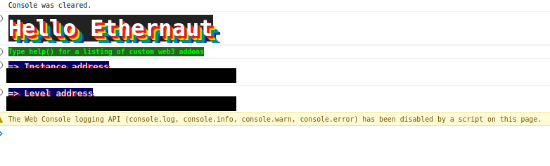
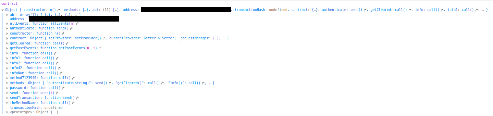

# 00: Hello Ethernaut

The Ethernaut is a Web3/Solidity based wargame inspired by overthewire.org, played in the Ethereum Virtual Machine, in which each level is based on a smart contract that needs to be "hacked".

This is a sample walkthrough for the level called "Hello Ethernaut".

## Setup

First off we need a wallet. Get the Metamask Wallet from https://metamask.io/ and choose whichever network works for you ( in my case i will be using Rinkeby's testnet).
Fund the wallet with Chainlink's faucet https://faucets.chain.link/rinkeby and then click on the button "Get new instance" to deploy the contract.

## Steps for completing the level
Click on F12 to get on Developer Tools. You will get something like this:

Run contract and you should get this:

After that we run the contract.info1() command and manage to find some type of information that we need:
><value>: "Try info2(), but with \"hello\" as a parameter."

Then with contract.info2("hello") we get:
><value>: "The property infoNum holds the number of the next info method to call."

For contract.infoNum() we receive a special case, an array who has a single slot, in which we found the number "42":
>words: Array [ 42, <1 empty slot> ]

With that concluded, we try contract.info42() and receive:
><value>: "theMethodName is the name of the next method."

Try contract.theMethodName():
><value>: "The method name is method7123949."

And continue with contract.method7123949():
><value>: "If you know the password, submit it to authenticate()."

By running contract command we found out theres a contract.password() command and we can try that one:
><value>: "ethernaut0"

Now we can use the contract.authenticate() command, with "ethernaut0" as parameter. The metamask wallet should pop op on your screen and ask to confirm the transaction.
Select the confirm button and now the transaction should appear as fulfilled:
><value>: Object { tx: "yourTransactionAddress", receipt: {…}, logs: [] }

Now finish the level by using the submit button at the bottom of the page.

Congrats! See you on to the next level:wave:
